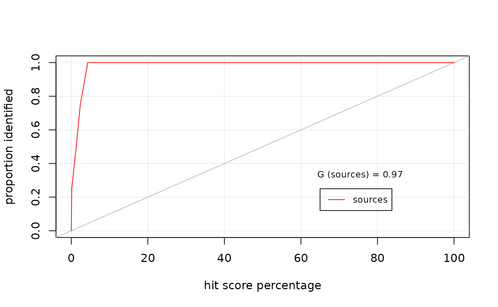
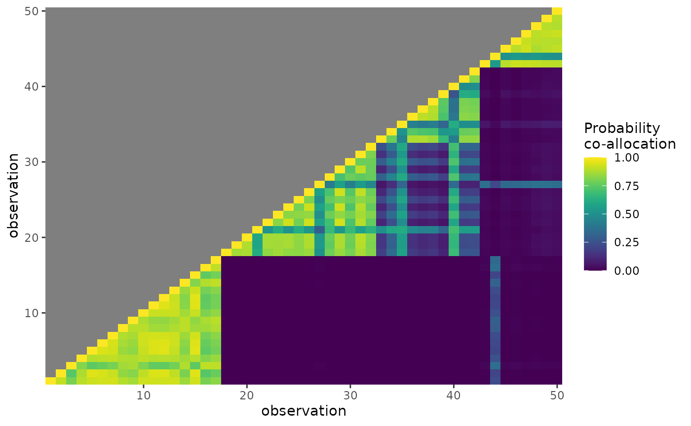
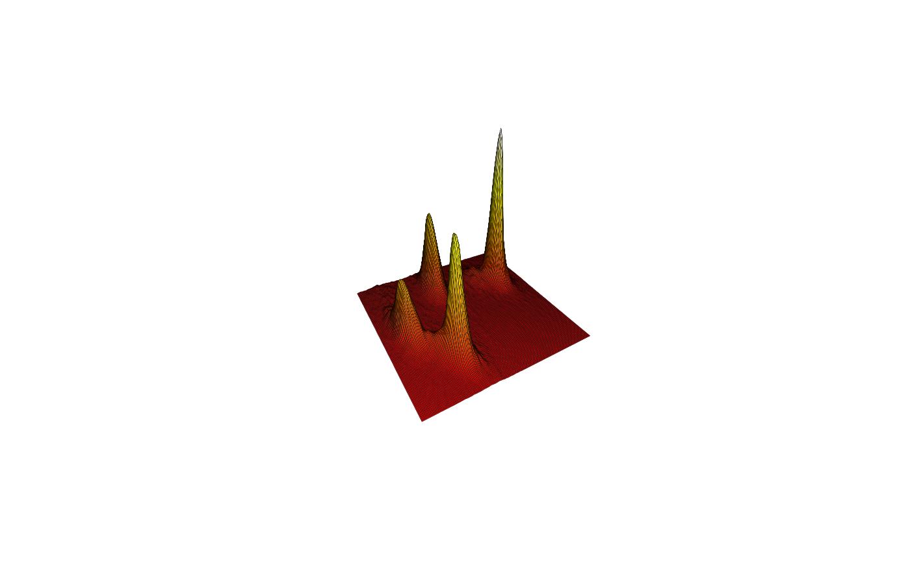
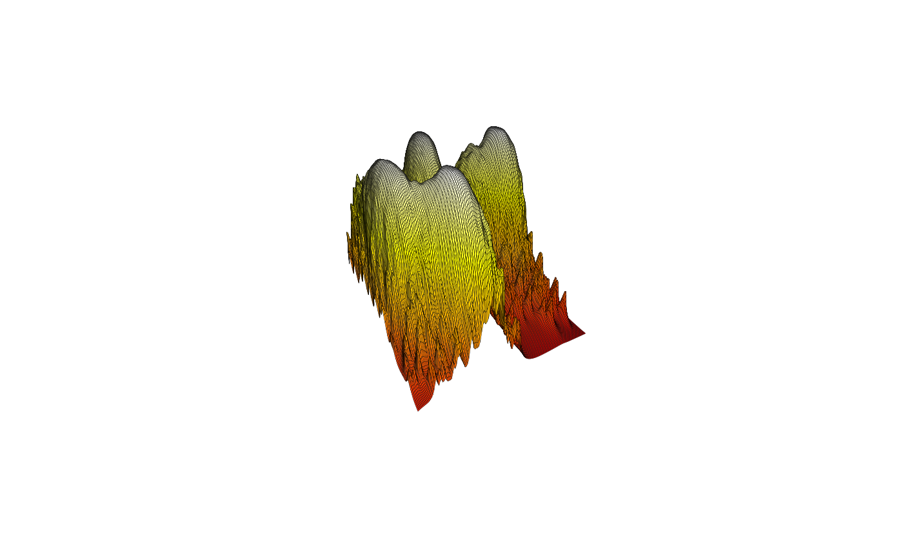
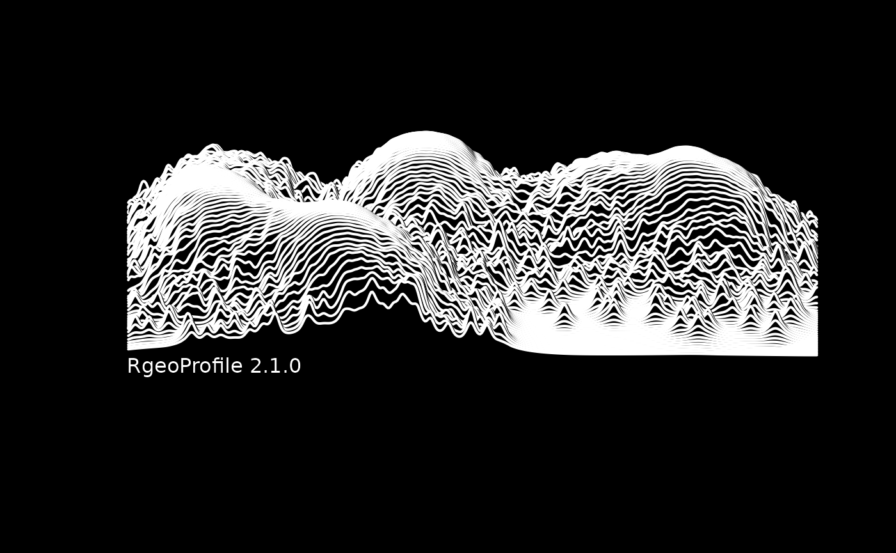

# Using GeoProfile

## Introduction

- What is geoprofiling?
- Where does it come from?
- Where else can it be applied?
- Why should you use it?

## Loading data

First we must load the data and format it correctly for use in the
[`geoParams()`](https://emmadeeks97.github.io/GeoProfile/reference/gp.params.md)
function. Here we will use the example data of crime in North London.

In the case of the example data these are actually already in the
correct format, however the relevant code is included for completeness.

``` r
library(GeoProfile)
d <- LondonExample_crimes
s <- LondonExample_sources

d <- gp.data(d)

# Source data should be loaded with is.source = TRUE
s <- gp.data(s, is.source = TRUE)
```

### Explaining the data

This data comes in two parts:

1.  `d` a set of coordinates representing events that we have observed.
2.  `s` a set of coordinates representing sources of these events.

Of these two dataframes, only `d` is used for the model fitting. In most
cases this is the only data you are working with.

The data in `s` could be a suspected set of places that are the source
of the activity.

Given the origin of geoprofiling as a technique (in criminology), the
example data here is a set of crime reports `d` and a set of potential
“hideouts” `s`.

If the posterior distribution overlaps with a point in `s` then we can
say it is quite likely that the perpetrators of said crime are located
in that hideout.

## Model parameterisation

Once the data is loaded, we must set up the model and MCMC (Monte Carlo
Markov Chain) parameters (for full details see the
[`geoParams()`](https://emmadeeks97.github.io/GeoProfile/reference/gp.params.md)
help file).

For this run let’s set up with some sensible sigma settings (sigma
represents the standard deviation of the dispersal distribution in km).

You can parameterise the prior of sigma in one of three ways:

- Defining `sigma_mean` and `sigma_var`
- Defining `sigma_mean` and `sigma_squared_shape`
- Defining `sigma_squared_shape` only

As an example, if using `sigma_mean` and `sigma_squared_shape` to
parameterise, the exact value of `sigma_var` derived here is calculated
as follows:

$$\alpha = \ \text{sigma\_squared\_shape}$$

$$\beta = \exp\left( 2\ln\bar{\sigma} + 2\ln\left| \,\Gamma(\alpha) \right| + 2\ln\left| \,\Gamma(\alpha - 0.5) \right| \right)$$

$$\epsilon = \sqrt{\beta}\ \frac{\Gamma(\alpha - 0.5)}{\Gamma(\alpha)}$$$$\text{sigma\_var} = \frac{\beta}{(\alpha - 1) - \epsilon^{2}}$$

For the MCMC we’ll use 5 chains, discarding 1,000 iterations of burnin
and sampling 10,000 iterations to generate the final posterior
distribution.

``` r
# set model and MCMC parameters
p = gp.params(
  data = d,
  sigma_mean = 1,
  sigma_squared_shape = 2,
  chains = 5,
  burnin = 1e3, 
  samples = 1e4
  )
#> ℹ Using sigma_mean and sigma_squared_shape to define prior on sigma
```

And let’s just check to see what our full parameters object looks like:

``` r
p
#> Geoprofile Parameters (to 4 dp):
#> 
#> === Model ===
#> Sigma: mean = 1, var = 0.2732, squared_shape = 2, squared_rate = 1.2732
#> Prior: Mean longitude = -0.1038°, Mean latitude = 51.5175°
#> Tau: 6.5177
#> Alpha: shape = 0.1, rate = 0.1
#> 
#> === MCMC ===
#> Burnin: 5 chains @ 1000 iterations (print every 100)
#> Sampling: 10000 iterations (print every 1000)
#> 
#> === Output ===
#> Longitude range: -0.2061°:-0.0014°
#> Latitude range:  51.4915°:51.5435°
#> Cells: 500x500
```

## Running the MCMC model

Now we are ready to actually fit the geoprofile model using an MCMC
approach.

Posterior draws are smoothed to produce a posterior surface, and
converted into a geoProfile.

The outputs of this function include posterior draws of alpha and sigma
under the variable-sigma model.

``` r
m = geoMCMC(data = d, params = p)
```

    #> ✔ Data object passed all checks!
    #> ✔ Params object passed all checks!
    #> ── MCMC Log ────────────────────────────────────────────────────────────────────
    #> Initiating burn-in phase (5 chains)
    #>   iteration: 100
    #>     convergence at the GR=1.1 level reached within 100 iterations
    #>   iteration: 200
    #>   iteration: 300
    #>   iteration: 400
    #>   iteration: 500
    #>   iteration: 600
    #>   iteration: 700
    #>   iteration: 800
    #>   iteration: 900
    #>   iteration: 1000
    #>     final GR statistic: GR=1.00324
    #> 
    #> Initiating sampling phase
    #>   iteration: 1000
    #>   iteration: 2000
    #>   iteration: 3000
    #>   iteration: 4000
    #>   iteration: 5000
    #>   iteration: 6000
    #>   iteration: 7000
    #>   iteration: 8000
    #>   iteration: 9000
    #>   iteration: 10000
    #> 
    #> MCMC completed in 0.469 seconds
    #> ── MCMC Log End ────────────────────────────────────────────────────────────────
    #> ℹ Smoothing posterior surface...
    #> ✔ Maximum-Likelihood lambda = 0.069

*Note: we can control the bandwidth of the posterior smoothing by
specifying the `lambda` argument. If this is not specified, the optimal
bandwidth is chosen via maximum-likelihood.*

Let’s plot the prior and posterior of sigma. Remember that sigma is the
standard deviation of the dispersal distribution, so a larger posterior
value is more varied dispersal in the data.

``` r
geoPlotSigma(params = p, mcmc = m)
```


## Plotting

Using the wonderful `leaflet` package, we can plot the posterior
surfaces on a map!

Here the red dots are crime reports, the blue dots are potential
sources, and the heatmap is the posterior probability surface.

``` r
# plot profile on map
mapGP <- geoPlotLeaflet(params = p, data = d, source = s, surface = m$geoProfile)
mapGP
```

We can also retrieve hitscores for our potential sources (measures of
how likely a potential source is to be the actual source of observed
events).

``` r
# get hitscores
hs <- geoReportHitscores(params = p, source = s, surface =m$geoProfile)
hs
#>   latitude longitude     hs
#> 1  51.5252   -0.0418 0.1156
#> 2  51.5012   -0.1421 1.2908
#> 3  51.5175   -0.1731 4.3052
#> 4  51.5321   -0.1238 2.3436
```

And here is a Lorenz plot for the same data.

``` r
# produce Lorenz plot
Gini <- geoPlotLorenz(hit_scores = hs, crimeNumbers = NULL)
```



``` r
Gini
#> G_sources 
#>      0.97
```

``` r
# zoom
# FW: Currently does not work due to incorrect arguments

# zoomLon = c(-0.1, -0.01)
# zoomLat = c(51.51, 51.54)
# mapZoom <- geoPlotLeaflet(lonLimits = zoomLon, latLimits = zoomLat, params = p,
#                 data = d, source = s, surface = m$geoProfile)
# mapZoom
```

We can also plot posterior allocation and co-allocation

``` r
# plot allocation
geoPlotAllocation(mcmc = m)
```



``` r
# plot co-allocation
geoPlotCoallocation(mcmc = m)
```



3D plots are almost entirely unhelpful from a data-communication
standpoint (unless interactive and animated), however they can look nice
in decorative roles.

You can create these using
[`geoPersp()`](https://emmadeeks97.github.io/GeoProfile/reference/geoPersp.md)function.

``` r
# produce perspective plots
# probabilities
geoPersp(surface = m$posteriorSurface, aggregate_size = 3, surface_type = "prob")
```


``` r
# ranked surface
geoPersp(surface = m$geoProfile, aggregate_size = 3)
```



A better way of visualising data in 3D is to use an interactive plot
using the
[`geoSurface3D()`](https://emmadeeks97.github.io/GeoProfile/reference/geoSurface3D.md)
function.

This gets around the problem of data occlusion, though is still mostly
useful in a decorative scenario.

*Note:
[`geoSurface3D()`](https://emmadeeks97.github.io/GeoProfile/reference/geoSurface3D.md)
requires the `plotly` package to be installed.*

This particular representation has been downsampled for this example to
save on resources.

``` r
geoSurface3D(m$geoProfile, "gp")
```

We can also get the centroids of the data split by the posterior groups.
This is a coarse indication of best-guess source locations.

``` r
# find centroids of data split by best grouping (placeholder for more thorough method)
ms <- geoModelSources(mcmc = m, data = d)
ms
#>     longitude latitude
#> 1 -0.03983748 51.52633
#> 2 -0.14466651 51.50410
#> 3 -0.11555298 51.53351
#> 5 -0.18306789 51.51804
```

``` r
# add peaks to map
# NB requires ggplot2
# FW: mapGP is no longer a ggplot object (as it is now a leaflet object!) This needs a fix.
# library(ggplot2)
# mapSource <- mapGP + geom_point(aes(ms$longitude,ms$latitude), size=6, pch = 3, col="red")
# mapSource
```

Finally (just for fun) we can plot the posterior surface in the style of
the famous Unknown Pleasures album cover by Joy Division.

``` r
# plot surface in style of 'unknown pleasures', for fun
unknownPleasures(m$geoProfile, paper_ref = "RgeoProfile 2.1.0")
```



## Benchmarking

Alternative methods for solving this problem include the ring search
approach (searching in circles of iteratively expanding radii around
each observation).

This approach is implemented in the
[`geoRing()`](https://emmadeeks97.github.io/GeoProfile/reference/geoRing.md)
function, which can be plotted in the same manner as
[`geoMCMC()`](https://emmadeeks97.github.io/GeoProfile/reference/geoMCMC.md)
output.

``` r
#------------------------------------------------------------------
# compare to alternative ring search strategy
#------------------------------------------------------------------
# compare to geoprofile based on ring search strategy
surface_ring <- geoRing(params = p, data = d, source = s, mcmc = m)
gp_ring <- geoProfile(surface = surface_ring)
# map of ring search geoprofile
mapRing <- geoPlotLeaflet(params = p, data = d, source = s, surface = gp_ring,
                surfaceCols = c("red", "white"))
mapRing
```

``` r
# hitscores of ring search geoprofile
hs_ring <- geoReportHitscores(params = p, source = s, surface = gp_ring)
hs_ring
#>   latitude longitude      hs
#> 1  51.5252   -0.0418  3.8832
#> 2  51.5012   -0.1421  8.4788
#> 3  51.5175   -0.1731 33.9140
#> 4  51.5321   -0.1238 27.6544
```

## Incorporating GIS data

We may wish to use GIS data to modify the geoprofile in some manner. For
example to exclude areas not on land, or weight the probabilities within
a specific postcode differently.

We can do this using the
[`geoMask()`](https://emmadeeks97.github.io/GeoProfile/reference/geoMask.md)
function.

``` r
#------------------------------------------------------------------
# incorporate GIS data
#------------------------------------------------------------------
# read in north London shapefile as mask and adjust surface
north_london_mask <- geoShapefile()

# restrict mask to Tower Hamlets
TH_mask <- north_london_mask[which(north_london_mask$NAME == "Tower Hamlets"),]
prob_masked <- geoMask(probSurface = m$posteriorSurface, params = p, mask = TH_mask,
                operation = "outside", scaleValue = 1e-9)
gp_masked <- geoProfile(prob_masked$prob)
```

``` r
# plot new surface
mapMask <- geoPlotLeaflet(params = p, data = d, source = s, surface = gp_masked)

# FW: this part does not currently work
# breakPercent = seq(0,25,l = 11))
mapMask
```

``` r

# hs of masked surface
hs_mask <- geoReportHitscores(params = p, source = s, surface = gp_masked)
hs_mask
#>   latitude longitude      hs
#> 1  51.5252   -0.0418  0.1156
#> 2  51.5012   -0.1421 23.3780
#> 3  51.5175   -0.1731 25.8692
#> 4  51.5321   -0.1238 24.2344
```
